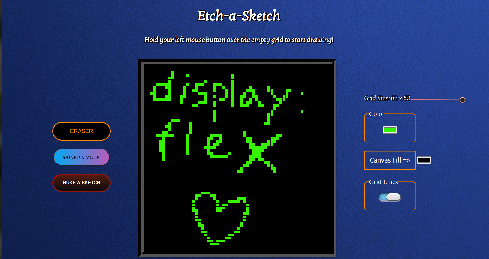

# Etch-a-Sketch Game

Things I learned over the course of this project.

1. Manipulating the DOM with methods and other techniques. 

2. Utilizing many new html elements and doing a lot of vanilla CSS in designing my buttons.

3. The security risks of innerHTML (JS injections) and why it’s better to use something like .textContent.

4. Using “this” for the first time in my Javascript code.

5. Implementing various solutions and ideas from other people into my own project and making them all work.

6. Learning efficient prompting techniques when consulting chatGPT 3.5.

Live preview: https://tankengine-ish.github.io/Etch-a-Sketch_Game/ 

Screengrab:

